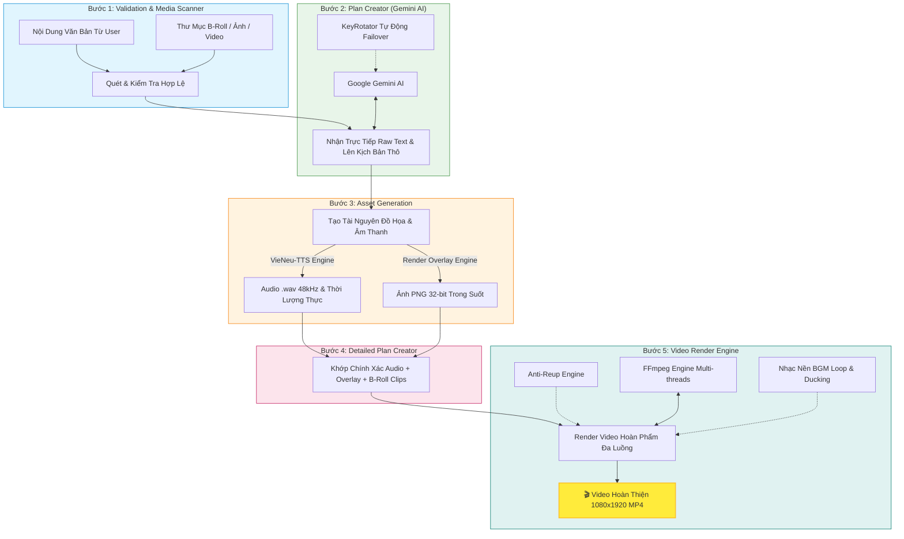

# 🎬 AI Video Creator

> **Hệ thống tự động hóa sản xuất video ngắn triệu view (TikTok, Reels, Shorts) tỷ lệ dọc 9:16 đa luồng từ nội dung văn bản và kho tư liệu B-roll.**

[](https://www.python.org/)
[](https://fastapi.tiangolo.com/)
[](https://ai.google.dev/)
[](https://github.com/)
[](https://ffmpeg.org/)
[](https://en.wikipedia.org/wiki/SOLID)

---

## 📖 Mục Lục
1. [Giới Thiệu Tổng Quan](#-giới-thiệu-tổng-quan)
2. [Kiến Trúc Luồng 6 Bước (6-Step Pipeline)](#-kiến-trúc-luồng-6-bước-6-step-pipeline)
3. [Tính Năng Đột Phá](#-tính-năng-đột-phá)
   - [Trích xuất thông tin & KeyRotator](#1-trích-xuất-thông-tin--xoay-vòng-gemini-api-key)
   - [Kịch bản Review chân thực & Thẻ cảm xúc](#2-kịch-bản-review-chân-thực--thẻ-cảm-xúc-âm-thanh)
   - [VieNeu-TTS & Voice Cloning](#3-vieneu-tts-v3-turbo--voice-cloning)
   - [Đồ họa Overlay CapCut/TikTok](#4-đồ-họa-overlay-capcuttiktok-đỉnh-cao-11-styles)
   - [Chống vi phạm bản quyền (Anti-Reup Engine)](#5-chống-vi-phạm-bản-quyền-anti-reup-engine)
   - [Tự động dọn dẹp bộ nhớ](#6-tự-động-dọn-dẹp-bộ-nhớ-tạm)
4. [Yêu Cầu Hệ Thống & Cài Đặt](#-yêu-cầu-hệ-thống--cài-đặt)
5. [Cấu Hình Môi Trường](#-cấu-hình-môi-trường)
6. [Hướng Dẫn Sử Dụng (CLI Usage & Python API)](#-hướng-dẫn-sử-dụng-cli-usage)
   - [Bảng tham số dòng lệnh (CLI)](#bảng-tham-số-dòng-lệnh-cli)
   - [Giải thích chi tiết tất cả các tham số](#giải-thích-chi-tiết-tất-cả-các-tham-số)
   - [Lệnh mẫu đầy đủ TẤT CẢ tham số](#1-lệnh-mẫu-đầy-đủ-tất-cả-các-tham-số-full-parameters-example)
   - [Các kịch bản sử dụng thực tế](#2-các-kịch-bản-sử-dụng-thực-tế)
   - [Sử dụng Python API (RenderOverlayEngine)](#3-sử-dụng-python-api-renderoverlayengine-đầy-đủ-tham-số)
7. [Cấu Trúc Thư Mục Dự Án](#-cấu-trúc-thư-mục-dự-án)
8. [Kiểm Thử (Testing)](#-kiểm-thử-testing)
9. [Quy Chuẩn Phát Triển](#-quy-chuẩn-phát-triển)

---

## 🌟 Giới Thiệu Tổng Quan

**AI Video Creator** là giải pháp toàn diện cho việc tự động hóa chuỗi quy trình sản xuất video ngắn định dạng dọc (**9:16 - 1080x1920**) dành riêng cho các nền tảng TikTok, Facebook Reels và YouTube Shorts. 

Từ một bài viết thô (tin tuyển dụng, bài viết giới thiệu sản phẩm, tin tức...) và một thư mục chứa ảnh/video B-roll, hệ thống sẽ:
1. Phân tích ngữ nghĩa và trích xuất dữ liệu cốt lõi bằng **Google Gemini 2.5 Flash**.
2. Tự động biên kịch thành các kịch bản video ngắn phong cách review cuốn hút, chân thực 100%, lồng ghép nhịp nhàng các thẻ âm thanh biểu cảm.
3. Chuyển đổi văn bản thành giọng đọc truyền cảm đạt chuẩn phòng thu 48 kHz bằng **VieNeu-TTS** hoặc **Voice Cloning** từ audio mẫu.
4. Render các tiêu đề chữ đè (Overlay Graphics) rực rỡ phong cách CapCut thịnh hành bằng **HTML5/CSS3** và **Chrome Headless**.
5. Ghép nối chính xác từng phân cảnh với hiệu ứng chuyển cảnh mượt mà (`fade`, `wipeleft`, `slideleft`...), nhạc nền BGM tự động căn chỉnh và thuật toán **Anti-Reup** độc quyền giúp video vượt qua kiểm duyệt trùng lặp của các nền tảng mạng xã hội.

---

## 🔄 Kiến Trúc Luồng 5 Bước (5-Step Pipeline)

Hệ thống được điều phối bởi [VideoCreationPipeline](file:///Volumes/aki/workspace/AI_Video_Creator/app/services/pipeline/coordinator.py) theo quy trình 5 bước độc lập, áp dụng chặt chẽ các nguyên lý **SOLID** và **Clean Architecture**:



---

## 🚀 Tính Năng Đột Phá

### 1. Truyền Trực Tiếp Input & Xoay Vòng Gemini API Key
- Module [KeyRotator](file:///Volumes/aki/workspace/AI_Video_Creator/app/services/key_rotator.py) tự động phân bổ và xoay vòng nhiều API keys. Khi gặp lỗi **HTTP 429 (Resource Exhausted / Quota Exceeded)**, hệ thống lập tức đánh dấu lỗi và chuyển sang key dự phòng tiếp theo mà không làm gián đoạn pipeline.
- [PlanCreatorEngine](file:///Volumes/aki/workspace/AI_Video_Creator/app/services/plan_creator/engine.py) tiếp nhận trực tiếp bài đăng/nội dung thô từ người dùng, lược bỏ bước trích xuất trung gian giúp tiết kiệm 50% thời gian gọi AI và bảo toàn 100% ngữ cảnh gốc.

### 2. Kịch Bản Review Chân Thực & Thẻ Cảm Xúc Âm Thanh
- [PlanCreatorEngine](file:///Volumes/aki/workspace/AI_Video_Creator/app/services/plan_creator/engine.py) được trang bị Prompt thiết kế riêng cho việc sáng tạo video ngắn:
  - **Trung thực 100%**: Dữ liệu nguồn không nhắc đến tuyệt đối không tự ý bịa đặt (không bịa bao ăn ở, xe đưa đón, lương thưởng).
  - **Tông giọng đời thường**: Xưng hô gần gũi (*tao - tụi bay*, *tui - mấy bà*), năng lượng dồi dào, thán từ giật tít (*Ớ chịu không nổi rồi*, *dễ sợ*, *đã vậy*).
  - **Thẻ cảm xúc âm thanh chuyên sâu**:
    - `[cười]` / `[chuckle]`: Đặt sau các câu ví von hài hước hoặc thán từ phấn khích.
    - `[thở dài]` / `[sigh]`: Diễn tả nỗi đau, trải nghiệm xin việc hụt hẫng trong quá khứ làm đòn bẩy tương phản.
    - `[hắng giọng]` / `[clear throat]`: Chuyển tông giọng nghiêm túc, mách nước quyền lợi chân ái.
  - **Cấu trúc 4 màn chuẩn**: Hook mở đầu (0-3s) ➔ Đòn bẩy thất vọng cũ (4-7s) ➔ Điểm sáng đãi ngộ thật ➔ Ví von & Kêu gọi hành động (CTA).

### 3. VieNeu-TTS v3 Turbo & Voice Cloning
- [TTSEngine](file:///Volumes/aki/workspace/AI_Video_Creator/app/services/tts_engine/engine.py) tích hợp mô hình **VieNeu-TTS (v3 Turbo, 48 kHz)** chất lượng cao:
  - **14 giọng đọc chuẩn 3 miền**:
    - **Miền Bắc**: `Minh Đức` (Mặc định), `Phạm Tuyên`, `Thanh Bình`, `Mai Anh`, `Trúc Ly`, `Ngọc Linh`, `Đoan Trang`.
    - **Miền Nam**: `Thái Sơn`, `Xuân Vĩnh`, `Minh Triết`, `Thùy Dung`, `Thục Đoan`.
    - **Miền Trung**: `Quang Sơn`, `Ngọc Trân`.
  - **Voice Cloning Mode**: Tự động sao chép giọng nói chỉ từ một đoạn audio mẫu 3 - 5 giây (`.wav`, `.mp3`).
  - **Bộ Phân Bổ Ngẫu Nhiên (VoiceCloneSelector)**: Tự động quét kho giọng mẫu trong `assets/voices` và phân bổ giọng đọc ngẫu nhiên cho từng video trong batch mà không sợ trùng lặp.
  - **Tăng tốc độ đọc linh hoạt (`--tts-speed`)**: Mặc định 1.15x cho nhịp nói sôi động, cuốn hút trên TikTok.

### 4. Đồ Họa Overlay CapCut/TikTok Đỉnh Cao (11 Styles)
- [RenderOverlayEngine](file:///Volumes/aki/workspace/AI_Video_Creator/app/services/render_overlay_engine/engine.py) kết hợp sức mạnh của HTML5/CSS3 và **Google Chrome Headless** để kết xuất các lớp chữ đè (Overlay) chuẩn đồ họa vector sắc nét (1080x1920 RGBA kênh alpha trong suốt):
  - **11 Phong cách độc quyền**:
    1. `bubble_cloud`: ☁️ Đám Mây Highlight viền đen sắc nét.
    2. `torn_paper`: 📰 Báo Xé Cổ Điển lởm chởm, xoay nhẹ tự nhiên.
    3. `pastel_multicolor`: 🌸 Kẹo Ngọt Đa Sắc dải màu pastel cầu vồng xoay vòng từng từ kèm mini flower.
    4. `marshmallow_pink`: 🍬 Kẹo Dẻo Mây Hồng bồng bềnh nữ tính với lòng chữ kẹo ngọt tươi sáng và viền đen nét 8px.
    5. `vlog_doodle`: ✨ Mini Vlog 3D Vàng/Cyber viền phấn nghệ thuật, tia comic rực rỡ và sticker doodle.
    6. `daisy_diary`: 🌼 Nhật Ký Hoa Cúc Y2K dễ thương kèm cụm hoa cúc 3D.
    7. `ocean_chalk`: 🌊 Biển Xanh Sticker Phấn tươi mát, viền kem mềm mại.
    8. `retro_groovy`: ✌️ Retro Groovy 70s Cam Bí Ngô 3D khối màu teal cổ điển.
    9. `tropical_contour`: 🌴 Tropical Viền 3 Tầng Vàng/Cam/Hồng rực rỡ nhiệt đới.
    10. `grid_notebook`: 📖 Vở Kẻ Ô Diary Y2K viền sticker nổi bật.
    11. `baby_blue_puffy`: ☁️ Baby Blue Puffy Mây Xanh bồng bềnh 3D.
  - **22 Google Fonts Display/3D tuyển chọn**: Tự động ngắt dòng tiếng Việt thông minh (`wrap_text_lines`) tránh tràn khung hình, tự động bốc ngẫu nhiên hoặc chỉ định font chữ theo sở thích.
  - **Kho 50+ Bảng màu Color Hunt & Thuật toán ánh xạ HLS**: Tự động bốc ngẫu nhiên từ kho Color Hunt (hoặc lọc theo các tag: `pastel`, `neon`, `warm`, `cold`, `retro`, `cute`, `vintage`), chuyển đổi màu sắc mượt mà qua các hàm `to_candy_color`, `to_pastel_cloud`, `generate_pastel_rainbow` và `get_vibrancy` bảo đảm màu sắc luôn hài hòa, sống động.

### 5. Chống Vi Phạm Bản Quyền (Anti-Reup Engine)
- [AntiReupEngine](file:///Volumes/aki/workspace/AI_Video_Creator/app/services/video_render_engine/anti_reup_engine.py) áp dụng các kỹ thuật biến đổi vi mô để lách thuật toán kiểm duyệt nội dung trùng lặp của các nền tảng mạng xã hội:
  - **Micro Color Jitter**: Biến đổi nhẹ độ bão hòa màu, độ sáng và độ tương phản.
  - **Dynamic Zoom Curve**: Hiệu ứng zoom nhẹ ngẫu nhiên (1.00x đến 1.035x) tạo chuyển động tinh tế.
  - **Micro Speed Fluctuation**: Thay đổi tốc độ khung hình vi mô (0.98x - 1.02x) không làm méo âm thanh.
  - **Film Grain & Audio Noise**: Chèn lớp hạt nhiễu vi mô vô hình với mắt người nhưng thay đổi hoàn toàn mã hash của video.
  - Hỗ trợ 3 cấp độ bảo vệ: `low`, `medium`, `high`.

### 6. Tự Động Dọn Dẹp Bộ Nhớ Tạm
- Quá trình xử lý sinh ra các file audio phân đoạn, ảnh PNG overlay và video scene tạm thời trong `storage/temp/<session_id>`.
- Hệ thống tự động dọn dẹp sạch sẽ thư mục session ngay khi hoàn tất quá trình render để giải phóng dung lượng đĩa cứng. Có thể kích hoạt cờ `--keep-temp` khi cần giữ lại file để gỡ lỗi (debug).

---

## 💻 Yêu Cầu Hệ Thống & Cài Đặt

### 1. Yêu Cầu Phần Cứng & Phần Mềm
- **Hệ điều hành**: macOS (Apple Silicon / Intel), Linux (Ubuntu 20.04+) hoặc Windows (WSL2).
- **Python**: Phiên bản `3.10` trở lên.
- **FFmpeg**: Đã được cài đặt và có trong `PATH` hệ thống (hỗ trợ bộ giải mã `libx264` và `aac`).
  - *macOS*: `brew install ffmpeg`
  - *Ubuntu/Debian*: `sudo apt update && sudo apt install -y ffmpeg`
- **Google Chrome / Chromium**: Để render đồ họa overlay HTML5/CSS3.
  - Hệ thống tự động dò tìm binary tại các đường dẫn mặc định trên macOS và Linux.

### 2. Cài Đặt Môi Trường Ảo & Thư Viện

```bash
# 1. Clone repository hoặc di chuyển vào thư mục dự án
cd /path/to/AI_Video_Creator

# 2. Khởi tạo môi trường ảo Python
python3 -m venv venv

# 3. Kích hoạt môi trường ảo
# Trên macOS / Linux:
source venv/bin/activate
# Trên Windows:
# venv\Scripts\activate

# 4. Cài đặt các thư viện phụ thuộc
pip install --upgrade pip
pip install -r requirements.txt
```

---

## ⚙️ Cấu Hình Môi Trường

### 1. Cấu Hình Gemini API Key
Hệ thống hỗ trợ 2 cách cung cấp Gemini API Key:

- **Cách 1: Thiết lập biến môi trường (Khuyên dùng)**
  ```bash
  export GEMINI_API_KEY="AIzaSyYourGeminiApiKeyHere"
  ```
- **Cách 2: Truyền trực tiếp danh sách keys qua tham số CLI (Hỗ trợ nhiều key)**
  ```bash
  python cli.py --api-keys AIzaSyKey1 AIzaSyKey2 AIzaSyKey3 ...
  ```

### 2. Chuẩn Bị Kho Dữ Liệu Tư Liệu (Assets)
Đảm bảo các thư mục tư liệu sau được bố trí:
- `assets/samples/`: Chứa file văn bản mẫu (VD: `sample_job.txt`) và video b-roll mẫu (`company_media/`).
- `assets/voices/`: Chứa các file audio mẫu (`.wav`, `.mp3`) phục vụ Voice Cloning ngẫu nhiên.
- `assets/music/`: Chứa các file nhạc nền MP3/WAV.
- `assets/fonts/`: Chứa font chữ mặc định bổ trợ.

---

## 🎯 Hướng Dẫn Sử Dụng (CLI Usage & Python API)

Điểm nhập lệnh chính thức của dự án là [cli.py](file:///Volumes/aki/workspace/AI_Video_Creator/cli.py) (hoặc trực tiếp qua [app/services/pipeline/main.py](file:///Volumes/aki/workspace/AI_Video_Creator/app/services/pipeline/main.py)). Ngoài ra, hệ thống cũng cung cấp Python SDK API mạnh mẽ cho từng module độc lập.

---

### Bảng Tham Số Dòng Lệnh (CLI)

Dưới đây là danh sách đầy đủ toàn bộ **23 tham số dòng lệnh** được hỗ trợ:

| Tham Số | Cờ Rút Gọn / Alias | Kiểu Dữ Liệu | Mặc Định | Ý Nghĩa / Mục Đích Sử Dụng |
| :--- | :--- | :---: | :---: | :--- |
| `--config` | — | `str` | `config.json` | Đường dẫn tới file cấu hình JSON (mặc định nạp `config.json`, cờ CLI sẽ override runtime không ghi đè file). |
| `--content-file` | — | `str` | `None` | Đường dẫn tới file văn bản (`.txt`, `.md`) chứa nội dung nguồn bài viết / tin tuyển dụng. |
| `--content` | — | `str` | `None` | Chuỗi văn bản nội dung truyền trực tiếp trên terminal (thay thế cho `--content-file`). |
| `--source-folder` | — | `str` | `assets/samples/company_media` | Thư mục chứa kho video và hình ảnh B-roll làm nền phân cảnh. |
| `--num-videos` | — | `int` | `1` | Số lượng video thành phẩm độc lập cần sản xuất trong 1 lượt chạy (từ 1 đến 10). |
| `--api-keys` | — | `list[str]` | `[]` | Danh sách 1 hoặc nhiều Gemini API Keys (xoay vòng tự động khi gặp HTTP 429). |
| `--model` | — | `str` | `gemini-2.5-flash` | Tên mô hình Gemini AI sử dụng cho bóc tách và biên kịch (`gemini-2.5-flash`, `gemini-1.5-pro`...). |
| `--voice` | — | `str` | `Minh Đức` | Tên giọng đọc AI mặc định từ VieNeu-TTS (hỗ trợ 14 giọng đọc chuẩn Bắc - Trung - Nam). |
| `--tts-speed` | `--speed` | `float` | `1.15` | Hệ số tốc độ giọng đọc AI (từ `0.5` đến `2.0`, `1.15x` tối ưu nhịp nói lôi cuốn TikTok). |
| `--voice-clone-path` | — | `str` | `None` | Đường dẫn file audio mẫu (`.wav`, `.mp3`) để clone giọng đọc cố định cho tất cả video. |
| `--voices-dir` | — | `str` | `assets/voices` | Thư mục chứa kho file audio mẫu để bốc ngẫu nhiên giọng clone cho từng video. |
| `--randomize-voice-clone` | `--random-voice` | `flag` | `True` | Bật tự động bốc ngẫu nhiên voice clone từ `--voices-dir` cho mỗi video trong batch. |
| `--no-random-voice` | `--no-randomize-voice-clone` | `flag` | `False` | Tắt tự động bốc ngẫu nhiên giọng đọc clone (sẽ dùng voice preset hoặc voice chỉ định). |
| `--sync-voice-speed` | — | `flag` | `True` | Bật thuật toán tự động phân tích nhịp nói gốc của file clone và chuẩn hóa tốc độ đọc. |
| `--no-sync-voice-speed` | — | `flag` | `False` | Tắt đồng bộ hóa tốc độ clone (chuyển sang co giãn tĩnh thuần túy theo `--tts-speed`). |
| `--target-wps` | — | `float` | `2.85` | Tốc độ đọc mục tiêu cơ sở (từ/giây - Words Per Second, ~171 WPM nhịp điệu review sôi động). |
| `--bgm` | — | `str` | `None` | Đường dẫn file nhạc nền MP3/WAV cụ thể chèn vào video. |
| `--bgm-volume` | — | `float` | `0.10` | Âm lượng nhạc nền BGM (từ `0.0` đến `1.0`, `0.10` = 10% kết hợp Auto-Ducking tự động). |
| `--no-random-bgm` | — | `flag` | `False` | Tắt chế độ tự động bốc ngẫu nhiên nhạc nền BGM từ thư mục `assets/sounds/bgm/`. |
| `--pause-duration` | — | `float` | `0.5` | Khoảng thời gian ngắt nghỉ tự nhiên giữa các phân cảnh thoại (giây). |
| `--tts-seed` | — | `int` | `None` | Hạt giống ngẫu nhiên cố định cho engine TTS giúp tái tạo chính xác 100% ngữ điệu giọng đọc. |
| `--output-dir` | — | `str` | `storage/outputs` | Thư mục lưu trữ video MP4 thành phẩm hoàn thiện sau khi render. |
| `--keep-temp` | — | `flag` | `False` | Giữ lại toàn bộ file tạm (`.wav`, `.png`, `.mp4`) trong `storage/temp/<session_id>` để debug. |
| `--verbose` | `--verbor`, `-v` | `flag` | `False` | Hiển thị tất cả các log cùng lúc (dạng streaming nhiều dòng). Mặc định là chế độ gọn gàng (dùng `\r` đè dòng và cập nhật theo từng plan). |

---

### Giải Thích Chi Tiết Tất Cả Các Tham Số

#### 1. Nhóm Dữ Liệu Đầu Vào & Tư Liệu Nguồn (Input & Media)
- **`--content-file <path>`**:
  - *Mô tả*: Đường dẫn đến tệp văn bản (`.txt`, `.md`) chứa toàn bộ nội dung bài viết tuyển dụng, giới thiệu sản phẩm hoặc bài báo gốc.
  - *Lưu ý*: Phải cung cấp `--content-file` hoặc `--content`. Nếu cả hai đều vắng mặt, pipeline sẽ tự động đọc file mẫu `assets/samples/sample_job.txt`.
- **`--content <text>`**:
  - *Mô tả*: Truyền trực tiếp chuỗi văn bản trên dòng lệnh. Thích hợp cho việc test nhanh, chạy bằng script tự động hóa hoặc tích hợp Webhook/API.
- **`--source-folder <dir>`**:
  - *Mô tả*: Thư mục chứa các tệp media B-roll làm phông nền (hỗ trợ `.mp4`, `.mov`, `.jpg`, `.jpeg`, `.png`).
  - *Cơ chế*: Hệ thống sẽ tự động quét, phân tích kích thước và cắt ghép khớp từng giây với thời lượng phát âm thực tế của giọng đọc AI.
- **`--num-videos <int>`**:
  - *Mô tả*: Số lượng video độc lập cần sản xuất từ cùng một nội dung nguồn (mặc định: `1`, tối đa khuyến nghị: `10`).
  - *Cơ chế*: Mỗi video sẽ được Gemini AI sáng tạo một kịch bản hoàn toàn khác nhau về tiêu đề, góc tiếp cận, phong cách đồ họa và giọng đọc.

#### 2. Nhóm Gemini AI & Quản Lý API Keys (LLM Engine)
- **`--api-keys <key1> [key2 ...]`**:
  - *Mô tả*: Danh sách một hoặc nhiều Gemini API Keys cách nhau bởi dấu cách.
  - *Cơ chế*: Module `KeyRotator` quản lý danh sách keys theo cơ chế Round-Robin. Nếu một key gặp lỗi vượt hạn ngạch `HTTP 429 (Resource Exhausted)`, hệ thống tự động đánh dấu cooldown và chuyển tức thì sang key dự phòng tiếp theo mà không làm crash tiến trình.
  - *Lưu ý*: Nếu không truyền qua CLI, hệ thống sẽ tự động đọc từ biến môi trường `GEMINI_API_KEY`.
- **`--model <name>`**:
  - *Mô tả*: Tên mô hình Gemini được sử dụng ở Bước 2 (Trích xuất) và Bước 3 (Biên kịch).
  - *Giá trị phổ biến*: `gemini-2.5-flash` (mặc định, nhanh và sáng tạo cao), `gemini-1.5-flash`, `gemini-2.5-pro`.

#### 3. Nhóm Giọng Đọc & VieNeu-TTS Engine (Speech & Voice Cloning)
- **`--voice <name>`**:
  - *Mô tả*: Tên giọng đọc AI preset khi chạy chế độ TTS chuẩn không clone.
  - *Danh sách 14 giọng đọc hỗ trợ*:
    - **Miền Bắc**: `Minh Đức` (mặc định, nam ấm áp), `Mai Anh` (nữ tự nhiên), `Phạm Tuyên`, `Thanh Bình`, `Trúc Ly`, `Ngọc Linh`, `Đoan Trang`.
    - **Miền Nam**: `Thái Sơn` (nam review sôi nổi), `Xuân Vĩnh`, `Minh Triết`, `Thùy Dung` (nữ dịu ngọt), `Thục Đoan`.
    - **Miền Trung**: `Quang Sơn` (nam chân thực), `Ngọc Trân` (nữ nhẹ nhàng).
- **`--tts-speed`, `--speed <float>`**:
  - *Mô tả*: Hệ số nhân tốc độ giọng đọc AI (mặc định `1.15`).
  - *Dải giá trị*: Từ `0.5` (chậm rãi) đến `2.0` (cực nhanh). Mức `1.15x - 1.25x` là tiêu chuẩn vàng giúp video ngắn giữ chân người xem (retention rate) trên TikTok/Shorts.
- **`--voice-clone-path <path>`**:
  - *Mô tả*: Đường dẫn tới một file audio mẫu cụ thể (`.wav`, `.mp3` từ 3 - 10 giây) để sao chép ngữ điệu và màu giọng cố định cho toàn bộ các video thành phẩm.
- **`--voices-dir <dir>`**:
  - *Mô tả*: Thư mục chứa kho các file giọng mẫu (mặc định `assets/voices`).
- **`--randomize-voice-clone`, `--random-voice`**:
  - *Mô tả*: Cờ kích hoạt việc tự động chọn ngẫu nhiên một giọng đọc mẫu trong `--voices-dir` cho mỗi video (mặc định: **BẬT**). Giúp sản xuất hàng loạt video không bị trùng giọng đọc.
- **`--no-random-voice`**:
  - *Mô tả*: Tắt tính năng chọn ngẫu nhiên giọng clone. Khi cờ này được bật, hệ thống sẽ ưu tiên dùng `--voice-clone-path` (nếu có) hoặc quay về giọng preset `--voice`.
- **`--sync-voice-speed` / `--no-sync-voice-speed`**:
  - *Mô tả*: Tự động phân tích tốc độ nói gốc trong file audio clone mẫu. Nếu người nói mẫu nói quá chậm (ví dụ: 1.8 từ/giây) hoặc quá nhanh, thuật toán sẽ tự động bù trừ co giãn để đưa về nhịp chuẩn, đảm bảo câu thoại luôn rõ ràng, không bị líu lưỡi hay đứt quãng.
- **`--target-wps <float>`**:
  - *Mô tả*: Tốc độ đọc mục tiêu cơ sở (Words Per Second). Mặc định là `2.85 WPS` (~171 từ/phút), chuẩn mực cho phong cách review video ngắn hiện đại.
- **`--tts-seed <int>`**:
  - *Mô tả*: Hạt giống cố định (integer) cho quá trình tổng hợp âm thanh, giúp tái hiện chính xác cùng một ngữ điệu và phát âm khi cần test A/B hoặc debug.

#### 4. Nhóm Âm Thanh Nền & Nhịp Điệu (BGM & Timing)
- **`--bgm <path>`**:
  - *Mô tả*: Chỉ định một file nhạc nền cụ thể (`.mp3`, `.wav`) chèn vào toàn bộ video.
- **`--bgm-volume <float>`**:
  - *Mô tả*: Mức âm lượng cho nhạc nền, từ `0.0` (tắt) đến `1.0` (âm lượng gốc). Mặc định: `0.10` (10%).
  - *Cơ chế*: Hệ thống tích hợp tính năng **Auto-Ducking**: Nhạc nền sẽ tự động hạ nhỏ xuống khi có tiếng thoại của reviewer và tự động đẩy lớn âm lượng trong các khoảng nghỉ giữa các câu.
- **`--no-random-bgm`**:
  - *Mô tả*: Tắt chế độ tự động bốc ngẫu nhiên nhạc nền từ thư mục `assets/sounds/bgm/`.
- **`--pause-duration <float>`**:
  - *Mô tả*: Khoảng thời gian tĩnh lặng ngắt nghỉ giữa các phân cảnh thoại (mặc định: `0.5` giây), giúp người xem kịp tiếp nhận thông tin và tạo khoảng thở tự nhiên cho video.

#### 5. Nhóm Xuất File & Quản Lý Bộ Nhớ (Output & Storage)
- **`--output-dir <dir>`**:
  - *Mô tả*: Thư mục đích lưu trữ các video MP4 thành phẩm đã render xong (mặc định: `storage/outputs`).
- **`--keep-temp`**:
  - *Mô tả*: Giữ lại toàn bộ các file trung gian trong `storage/temp/<session_id>` (gồm audio từng scene, ảnh overlay PNG 32-bit, video cắt đoạn). Mặc định hệ thống sẽ tự động dọn dẹp sạch sẽ thư mục session ngay khi hoàn tất để tối ưu dung lượng ổ cứng.

---

### 1. Lệnh Mẫu Đầy Đủ TẤT CẢ Các Tham Số (Full-Parameters Example)

Lệnh dưới đây minh họa việc truyền **đầy đủ 100% các tham số dòng lệnh** cho pipeline sản xuất video:

```bash
python cli.py \
  --content-file assets/samples/sample_job.txt \
  --source-folder assets/samples/company_media \
  --num-videos 3 \
  --api-keys AIzaSyKeyAlpha123 AIzaSyKeyBeta456 AIzaSyKeyGamma789 \
  --model "gemini-2.5-flash" \
  --voice "Thái Sơn" \
  --tts-speed 1.20 \
  --voices-dir assets/voices \
  --randomize-voice-clone \
  --sync-voice-speed \
  --target-wps 2.90 \
  --bgm assets/sounds/bgm/tiktok_chill_vibe.mp3 \
  --bgm-volume 0.12 \
  --pause-duration 0.45 \
  --tts-seed 42 \
  --output-dir storage/outputs \
  --keep-temp
```

> **Giải thích kịch bản lệnh trên**:
> - Đọc nội dung tuyển dụng từ file `sample_job.txt` và lấy B-roll từ thư mục `company_media`.
> - Sản xuất đồng loạt **3 video khác biệt hoàn toàn** (`--num-videos 3`).
> - Cung cấp **3 Gemini API keys** để xoay vòng tải (`--api-keys`).
> - Bật tự động bốc ngẫu nhiên giọng clone từ kho `assets/voices` (`--randomize-voice-clone`), chuẩn hóa nhịp đọc ở mức `2.90 từ/giây` sôi động (`--sync-voice-speed`, `--target-wps 2.90`).
> - Chèn nhạc nền `tiktok_chill_vibe.mp3` với âm lượng `12%` kèm Auto-Ducking (`--bgm-volume 0.12`).
> - Khoảng nghỉ phân cảnh là `0.45s` tạo nhịp điệu dồn dập hấp dẫn.
> - Cố định hạt giống `seed=42` để đảm bảo kết quả có thể tái tạo chuẩn xác.
> - Giữ lại toàn bộ file tạm trong `storage/temp/` để kiểm tra đồ họa và âm thanh (`--keep-temp`).

---

### 2. Các Kịch Bản Sử Dụng Thực Tế

#### Kịch bản A: Sản xuất 1 video nhanh từ văn bản trực tiếp
```bash
python cli.py \
  --content "Tuyển 5 bạn nhân viên đóng gói bánh kẹo tại Tân Bình, lương 8.5 triệu, ca 8 tiếng bao ăn trưa" \
  --source-folder assets/samples/company_media \
  --num-videos 1
```

#### Kịch bản B: Sản xuất hàng loạt 5 video review giọng miền Nam kèm BGM ngẫu nhiên
```bash
python cli.py \
  --content-file assets/samples/sample_job.txt \
  --source-folder assets/samples/company_media \
  --num-videos 5 \
  --voice "Thái Sơn" \
  --tts-speed 1.2 \
  --no-random-voice
```

#### Kịch bản C: Chỉ định chính xác 1 file giọng đọc Clone mẫu
```bash
python cli.py \
  --content-file assets/samples/sample_job.txt \
  --source-folder assets/samples/company_media \
  --voice-clone-path assets/voices/reviewer_nam.wav \
  --no-random-voice \
  --tts-speed 1.15 \
  --num-videos 2
```

#### Kịch bản D: Chạy môi trường sản xuất nhiều API Key & lưu thư mục riêng
```bash
python cli.py \
  --content-file assets/samples/sample_job.txt \
  --source-folder /Volumes/Data/BRoll_Archive \
  --api-keys AIzaSyKey1 AIzaSyKey2 AIzaSyKey3 \
  --output-dir /Volumes/Data/TikTok_Final_Export \
  --num-videos 10
```

---

### 3. Sử Dụng Python API (RenderOverlayEngine Đầy Đủ Tham Số)

Ngoài việc chạy toàn bộ pipeline qua CLI, bạn có thể sử dụng trực tiếp module [RenderOverlayEngine](file:///Volumes/aki/workspace/AI_Video_Creator/app/services/render_overlay_engine/engine.py) trong mã nguồn Python để tự kết xuất ảnh đồ họa chữ đè (Overlay) chuẩn 1080x1920 RGBA trong suốt.

#### Bảng tham số phương thức `RenderOverlayEngine.render()`:

| Tham Số | Kiểu Dữ Liệu | Mặc Định | Ý Nghĩa / Mô Tả |
| :--- | :---: | :---: | :--- |
| `content` | `str` | *Bắt buộc* | Nội dung dòng chữ chính hiển thị to rõ trên overlay. |
| `subcontent` | `Optional[str]` | `None` | Nội dung dòng chữ phụ / sticker tag / điểm nhấn. |
| `style` | `Optional[Union[str, BaseOverlayStyle]]` | `None` | Phong cách overlay (11 styles độc quyền, ví dụ: `PastelMulticolorStyle()`, `"vlog_doodle"`...). Nếu để `None` sẽ dùng `BubbleCloudStyle()`. |
| `font` | `Optional[str]` | `None` | Tên font chữ Google Font (chọn từ 22 fonts tuyển chọn như `"Cherry Bomb One"`, `"Titan One"`, `"Fredoka"`...). Nếu `None` sẽ tự bốc ngẫu nhiên font phù hợp. |
| `palette` | `Optional[Union[str, ColorPalette, list, tuple]]` | `None` | Bảng màu 4 sắc độ: truyền ID (ví dụ: `"retro_sunset_70s"`), tuple 4 mã hex, hoặc `None` để **tự động bốc ngẫu nhiên từ 50+ bảng màu Color Hunt**. |
| `palette_tag` | `Optional[str]` | `None` | Lọc nhóm bảng màu Color Hunt ngẫu nhiên theo tag: `"pastel"`, `"neon"`, `"warm"`, `"cold"`, `"retro"`, `"cute"`, `"vintage"`. |
| `output_path` | `Optional[Union[str, Path]]` | `None` | Đường dẫn file PNG đích cần lưu. Nếu `None` sẽ tự tạo file tạm trong thư mục `storage/temp`. |
| `width` | `int` | `1080` | Chiều rộng khung hình đồ họa (pixels). |
| `height` | `int` | `1920` | Chiều cao khung hình đồ họa (pixels). |

#### Ví dụ mã nguồn Python đầy đủ các tham số:

```python
from pathlib import Path
from app.services.render_overlay_engine import (
    RenderOverlayEngine,
    PastelMulticolorStyle,
    VlogDoodleStickerStyle,
    MarshmallowPinkStyle,
    get_palette_by_id,
    list_palettes,
)

# 1. Khởi tạo engine kết xuất Chrome Headless
engine = RenderOverlayEngine()

# 2. Render đồ họa Overlay với ĐẦY ĐỦ các tham số
output_file = Path("output/my_custom_overlay.png")

result_path = engine.render(
    # [1] Nội dung văn bản chính (tự động wrap ngắt dòng thông minh)
    content="CƠ HỘI VIỆC LÀM ĐỘT PHÁ 2026",
    
    # [2] Dòng chữ phụ điểm nhấn kèm icon sinh động
    subcontent="LƯƠNG THƯỞNG HẤP DẪN & BAO ĂN Ở ☕ 🌸",
    
    # [3] Phong cách đồ họa (Chọn 1 trong 11 styles độc quyền)
    style=PastelMulticolorStyle(),
    
    # [4] Chỉ định font chữ Display 3D tiếng Việt (hoặc để None để tự random trong 22 fonts)
    font="Cherry Bomb One",
    
    # [5] Bảng màu Color Hunt: Có thể truyền ID, đối tượng ColorPalette, tuple 4 hex, hoặc None để random
    palette=None,
    
    # [6] Lọc nhóm bảng màu Color Hunt (pastel, neon, warm, cold, retro, cute, vintage)
    palette_tag="pastel",
    
    # [7] Đường dẫn lưu file PNG thành phẩm
    output_path=output_file,
    
    # [8] Độ phân giải khung hình chuẩn video dọc 9:16
    width=1080,
    height=1920,
)

print(f"Đã xuất đồ họa overlay thành công: {result_path}")
```

---

## 📁 Cấu Trúc Thư Mục Dự Án

```
AI_Video_Creator/
├── app/
│   ├── config.py                      # Thiết lập kích thước video 9:16, Chrome path, presets, anti-reup
│   └── services/
│       ├── content_extractor/         # Bước 2: Phân tích và trích xuất nội dung bằng Gemini AI
│       ├── key_rotator.py             # Cơ chế xoay vòng và failover tự động cho API Keys
│       ├── plan_creator/              # Bước 3: Biên kịch kịch bản thô 4 màn và prompt cảm xúc
│       ├── render_overlay_engine/     # Bước 4: Render đồ họa chữ đè HTML5/CSS3 với Chrome Headless
│       │   ├── engine.py              # Bộ điều phối kết xuất PNG 32-bit trong suốt
│       │   ├── fonts.py               # Quản lý 27 font Google Fonts tuyển chọn
│       │   └── styles.py              # Định nghĩa 12 phong cách Overlay độc quyền
│       ├── tts_engine/                # Bước 4: Chuyển văn bản thành giọng đọc VieNeu-TTS v3 Turbo
│       │   ├── constants.py           # 14 giọng đọc Bắc - Trung - Nam
│       │   └── engine.py              # Khởi tạo mô hình và xử lý Voice Cloning
│       ├── video_render_engine/       # Bước 6: Ghép nối cảnh và kết xuất video bằng FFmpeg
│       │   ├── core/                  # Models (VideoRenderPlan, RenderResult), Config, Exceptions, TaskLogger
│       │   ├── renderers/             # Động cơ kết xuất nền tảng (base, ffmpeg, macos, windows, factory)
│       │   ├── audio/                 # Quản lý âm thanh (bgm, voice, sound_effect, transition_sound)
│       │   ├── processors/            # Thuật toán cắt tư liệu (segment), anti-reup, đặt tên (output_namer)
│       │   ├── engine.py              # Động cơ render đa luồng (VideoRenderEngine)
│       │   └── main.py                # Điểm thực thi CLI Render Runner
│       └── pipeline/                  # Bộ điều phối trung tâm luồng 6 bước
│           ├── coordinator.py         # Logic thực thi xuyên suốt từ Bước 1 đến Bước 6
│           ├── models.py              # Định nghĩa dữ liệu PipelineInput, PipelineResult
│           └── main.py                # Điểm thực thi CLI Pipeline Runner
├── assets/
│   ├── fonts/                         # Kho font chữ tùy chỉnh
│   ├── music/                         # Kho nhạc nền
│   ├── sounds/
│   │   ├── bgm/                       # Kho nhạc nền BGM cho video TikTok
│   │   ├── effect/                    # Hiệu ứng âm thanh nhấn nhá (Ding, Chime...)
│   │   └── transition/                # Âm thanh chuyển cảnh (Whoosh, Swish...)
│   ├── samples/                       # Tài liệu mẫu và video B-roll mẫu
│   └── voices/                        # Kho audio mẫu dùng cho Voice Cloning
├── storage/
│   ├── outputs/                       # Thư mục chứa video thành phẩm hoàn thiện
│   ├── temp/                          # Thư mục chứa dữ liệu tạm thời theo session (tự dọn dẹp)
│   └── uploads/                       # Thư mục lưu trữ media người dùng tải lên
├── tests/                             # Test suite kiểm thử toàn diện cho từng engine
├── cli.py                             # CLI Entrypoint chính thức
├── requirements.txt                   # Danh sách thư viện phụ thuộc
└── README.md                          # Tài liệu kỹ thuật dự án
```

---

## 🧪 Kiểm Thử (Testing)

Dự án sở hữu bộ kiểm thử tự động toàn diện cho từng thành phần trong `tests/`:

```bash
# Chạy toàn bộ bài kiểm tra với pytest:
pytest tests/ -v

# Hoặc chạy với unittest:
python3 -m unittest tests/test_pipeline_flow.py

# Chạy riêng kiểm thử từng engine chuyên biệt:
python3 -m unittest tests/test_pipeline_flow.py
python3 -m unittest tests/test_render_overlay_engine.py
python3 -m unittest tests/test_video_render_engine.py
```

---

## 📐 Quy Chuẩn Phát Triển

Dự án áp dụng chặt chẽ các quy tắc kỹ nghệ phần mềm:
- **SOLID & Clean Architecture**: Phân tách rõ ràng giữa Domain Models, Engines và Pipeline Coordinator. Các engine phụ thuộc vào Interface trừu tượng (`BaseOverlayStyle`, `BaseVideoRenderer`).
- **DRY & KISS**: Tái sử dụng tối đa logic tiện ích, không thiết kế trừu tượng quá mức khi chưa có yêu cầu.
- **Quy chuẩn Git Commit**:
  - `feat:` Bổ sung tính năng hoặc engine mới.
  - `fix:` Sửa lỗi vận hành hoặc vá lỗi ngoại lệ.
  - `refactor:` Tối ưu hóa mã nguồn nhưng không thay đổi hành vi bên ngoài.
  - `docs:` Cập nhật tài liệu kỹ thuật, README.
  - `chore:` Điều chỉnh cấu hình, nâng cấp dependencies.
- **Bảo Mật**: Tuyệt đối không commit file `.env`, file cấu hình chứa API key hoặc dữ liệu định danh người dùng lên git repository.

---

<p align="center">
  Phát triển với sự tận tâm nhằm mang đến chất lượng video tự động hóa cao nhất.
</p>
